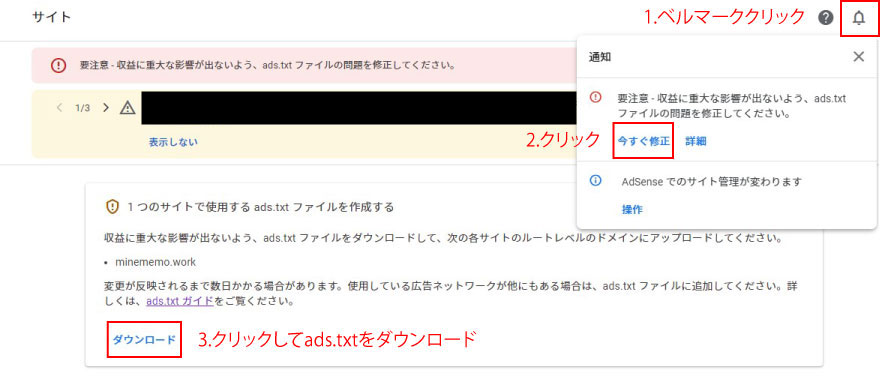

<div class="toc-title">目次</div>

```toc
```


はじめに
----

Google AdSenceのTOPに以下のようなアラートが出ていたため、ads.txt(アズテキスト)というものを設定しました。  


Gatsby.jsでの設定方法を記載しておきます。

設定方法
----

1. Google AdSenceにアクセスして、ベルマークをクリック
2. 「今すぐ修正」をクリック
3. 「ダウンロード」をクリック



4. 「ads.txt」がダウンロードされます
5. ./staticフォルダに格納

後はブログを公開すれば完了です。

ads.txtとは
---------

悪い人がなりすましを行い、**広告収入を奪っていく**ようなことがあるため、それを**防いでくれる**という仕組みです。

せっかくの収益を奪われたら勿体ないですし、ads.txtの設定自体はそんなに難しくないので、設置しておくことをお勧めします。

設定後は反映に時間がかかるため一旦やってみて、しばらくアラートが消えるか様子見をしてみてください。  
※最長で1か月ほどかかることがあるそうです。

<div class="boxparts ref">
  <div class="title"></div>
  
ads.txt に関するガイド  
<https://support.google.com/adsense/answer/7532444?hl=ja>

ads.txt に関する問題のトラブルシューティング  
[https://support.google.com/adsense/answer/9785860?hl=ja&amp;ref\_topic=7533328](https://support.google.com/adsense/answer/9785860?hl=ja&ref_topic=7533328)
</div>


<div class="balloon">
  <div class="icon"></div>
  <div class="talk">
アップロードが完了したらアラートが消えるまで数週間様子見してください。<br>  
お疲れさまでした！<br>
  </div>
</div>
