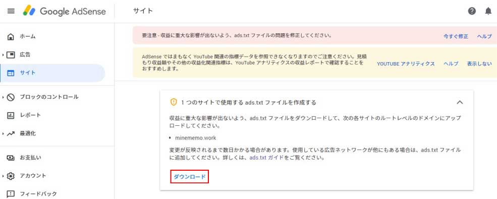

<div class="toc-title">目次</div>

```toc
```


はじめに
----

Google AdSenceのTOPに以下のようなアラートが出ていたため、ads.txt(アズテキスト)というものを設定しました。  


設定方法を記載しておきます。

サーバーはロリポップ使ってます。  
よろしくお願いします。

ads.txtとは
---------

悪い人がなりすましを行い、**広告収入を奪っていく**ようなことがあるため、それを**防いでくれる**という仕組みです。

せっかくの収益を奪われたら勿体ないですし、ads.txtの設定自体はそんなに難しくないので、設置しておくことをお勧めします。

設定後は反映に時間がかかるため一旦やってみて、しばらくアラートが消えるか様子見をしてみてください。  
※最長で1か月ほどかかることがあるそうです。

<div class="boxparts ref">
  <div class="title"></div>
  
ads.txt に関するガイド  
<https://support.google.com/adsense/answer/7532444?hl=ja>

ads.txt に関する問題のトラブルシューティング  
[https://support.google.com/adsense/answer/9785860?hl=ja&amp;ref\_topic=7533328](https://support.google.com/adsense/answer/9785860?hl=ja&ref_topic=7533328)
</div>


設定方法
----

1. Google AdSenceにアクセス
2. 「今すぐ修正」をクリック
3. 「1 つのサイトで使用する ads.txt ファイルを作成する～」の枠が表示されます
4. 「ダウンロード」をクリック
5. 「ads.txt」がダウンロードされます
6. FTPを開き、「ルートレベルのドメイン」にアップロード


<div class="boxparts point">
  <div class="title"></div>
  
**ルートレベルのドメインとは**URLでいうとドメインの直下にあたる場所です。  

なので、アップする際はFTPを開いて一番TOPの場所にアップロードしてください。

例）当ブログ  
https://minememo.work/の場合https://minememo.work/ads.txtという場所になります。

<span style="color: #ff0000;">※WordPressで構成ファイルがドメインの直下ではなく、作成したフォルダの中（1階層奥など）に配置してある場合はそのフォルダをTOPとして、ファイルを配置したらうまくいきました。</span>
</div>

<div class="boxparts memo">
  <div class="title"></div>
  
**「ロリポップ！FTP」を使う場合**   

ロリポップ！の管理画面へアクセス&gt;&gt;サーバーの管理・設定&gt;&gt;ロリポップFTPをクリック してFTPへアクセスしてください。
</div>


<div class="boxparts memo">
  <div class="title"></div>
  
**FTPとは**   

ファイルを送受信する仕組みのことを指します。  
今回のFTPはファイルをアップロードするためのツールという意味合いでもあります。
</div>


<div class="balloon">
  <div class="icon"></div>
  <div class="talk">
アップロードが完了したらアラートが消えるまで数週間様子見してください。<br>  
お疲れさまでした！<br>
（前回は2週間でしたが、今回は1日で反映してアラート消えました！やったね🐭）
  </div>
</div>
