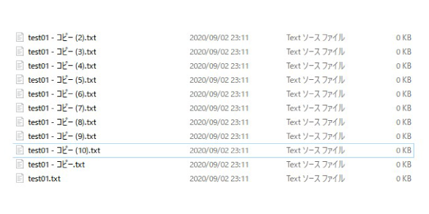
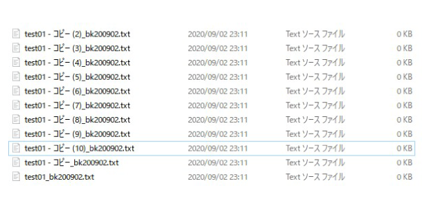

<div class="toc-title">目次</div>

```toc
```


はじめに
----

先日Windows PCでフォルダ内の複数のファイル名を一括で更新する必要がありました。  
コマンドプロンプトでコマンドを実行することで簡単にでき便利だったので、ブログに残しておきます。

追加前↓  
  
追加後↓  


手順
--

### 1.処理フォルダに移動

```
cd フォルダパス
```

### 2.ファイル名の末尾に「\_bk200902」を追加

```
for %A in (*) do ren "%A" "%~nA_bk200902%~xA"
```

## 解説

### for in do について
コマンドでの繰り返しの構文です。

### %A について
変数名です。

### \* について

全ファイル名を検知するためのワイルドカードという指定です。

### ren について

 renameコマンドの省略系です。

**<span style="color: #0000ff;">“%A”</span> を <span style="color: #0000ff;">“%~nA\_bk200902%~xA”</span> にリネーム**しています。

### %~nA について

forのオプション(変数参照の置換)で **<span style="color: #ff0000;">%Aの「ファイル名」だけを指定</span>**  しています。\_bk200902 は追加したい文言になります。

### %~xA について

**<span style="color: #ff0000;">%~xA</span>は** **<span style="color: #ff0000;">%Aの「拡張子」だけを指定</span>**  しています。

<div class="boxparts ref">
  <div class="title"></div>
  
コマンドのヘルプはコマンドプロンプトで/?で確認できます。

forのヘルプなら for/? でヘルプが見れる  
renのヘルプなら ren/? でヘルプが見れる

なおWindowsでもLinuxでも同じみたいです。
</div>


<div class="balloon">
  <div class="icon"></div>
  <div class="talk">
  便利じゃ💡
  </div>
</div>
