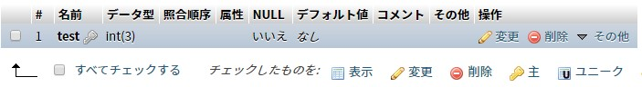
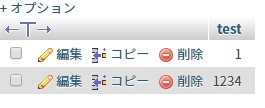
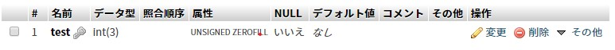
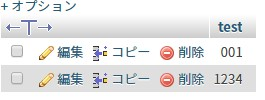
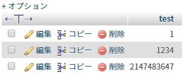

<div class="toc-title">目次</div>

```toc
```


はじめに
----

先日ひさしぶりにデータベースのテーブル作成をしたときに INT の桁数ってどういう意味だったけ？となったので調べました。

先に答えをいうと　**<span style="color: #ff0000;">ZEROFILLを設定した場合に有効な表示桁数</span>**　ということになります。

INT型には、TINYINT、SMALLINT、MEDIUMINT、BIGINT等いくつかありますが、本記事はよく使うINTのみ記載しています。

上記とINTの違いは保存できる数値の大きさになります。

INT型の桁数について
-----------

まずサンプルで以下のような設定でテーブルを作成しました。



今回気になったのは **(3)** の部分。  
調べてすぐ出てくるのは**桁数という回答。**

実際に3桁になるのか登録して確認。

  

うん。4桁入ってしまっている。  
こうなると(3)の桁数の意味がわからない。

実際何なのかしらべたら、(3)は<span style="color: #ff0000;">**表示桁数**</span>とのこと。

表示桁数っていっても実際は4桁はいってる！ってなりますが、この桁数の設定は**ZEROFILLという0埋めを設定**したときに始めて意味があるものらしいです。


<div class="balloon">
  <div class="icon"></div>
  <div class="talk">
  なるほど..さっそく試してみよう！<br>
  <b>構造&gt;&gt;変更</b>から<b>属性を「UNSIGNED ZEROFILL」</b>　に変えます。
  </div>
</div>


  
すると3桁もないデータ「1」は以下のように3桁で0埋めになります。

  
上記画像のとおり、(3)は<span style="color: #ff0000;">**「UNSIGNED ZEROFILL」を適用したときの桁数**</span>ということだったんですね。

**じゃあINTはどこまでの数値が入るの？**   

という疑問ですが、初期設定では **<span style="color: #ff0000;">4バイトの「-2,147,483,648 ～ 2,147,483,647」の範囲</span>** が入ります。

**2,147,483,647を超えた場合は2,147,483,647**で登録されます。

試しに2147483647+1の2147483648をINSERTしてみます。

```SQL:title=SQL
INSERT INTO `int_test`(`test`) VALUES (2147483648)
```

結果は 2147483648 は 2147483647 で登録されています。

これで(3)の桁数の意味がわかってすっきりしました。

なお桁数を設定しなかった場合は(11)で設定されます。

(11)はデフォルトらしいのですが、個人的には正直ZEROFILLを使うことは少なそうなので(11)でいいか。という結論になりました。

**またZEROFILLを設定した場合はかならずUNSIGNED**になります。  
以下参考までに。

<div class="boxparts ref">
  <div class="title"></div>
  
**UNSIGNEDとは**

INTの初期設定では4バイトの「-2,147,483,648 ～ 2,147,483,647」の範囲で数値の登録が可能です。<br>
UNSIGNEDを設定した場合は　**「0 ～ 4,294,967,295」の範囲**　で登録が可能になります。
</div>


<div class="balloon">
  <div class="icon"></div>
  <div class="talk">
  データーベース系は意外とネット上に情報が少ないので、難しいです！ 日々精進！！
  </div>
</div>