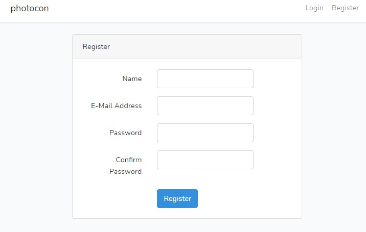
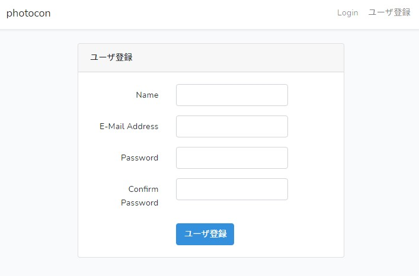

<div class="toc-title">目次</div>

```toc
```

はじめに
----

Laravel 絶賛勉強中です(スローペース🐢)

ユーザ登録のテンプレート resources\\views\\auth\\register.blade.php を見てたら、 {{ \_\_(‘Register’) }} なるものを発見👀

なんぞや？となって調べたので、ブログに残しておきます。

\_\_(”)とは
---------

「言語ファイルから翻訳文字列の取得を取得するヘルパ関数」とのこと。

言語ファイルとは resources\\lang 配下のファイルのことです。  
デフォで en が入っていますが、ja を追加することもできます。

その言語ファイルから、値を取得するための関数ということのようです。  
参照する言語ファイルは config\\app.php の locale の設定で決まります

<div class="boxparts ref">
  <div class="title"></div>
  
**■config\\app.php の locale の設定について**  

```php:title=php
'locale' =&gt; 'en'  
↓  
'locale' =&gt; 'ja',
```

をすると ja 配下の言語ファイルを参照します。

</div>

<div class="boxparts ref">
  <div class="title"></div>
  
**■jaファイルは以下のコマンドで一括で追加できます**

```
php -r "copy('https://readouble.com/laravel/6.x/ja/install-ja-lang-files.php', 'install-ja-lang.php');" 
php -f install-ja-lang.php  
php -r "unlink('install-ja-lang.php');"

```

参考：[Laravel 6.x validation.php言語ファイル](https://readouble.com/laravel/6.x/ja/validation-php.html?header=%25E8%25AA%25AC%25E6%2598%258E)
</div>

修正例
---

今回はユーザ登録画面のテンプレート resources\\views\\auth\\register.blade.php のボタンの文字を「Register」から「ユーザ登録」に変更したいと思います。

これを↓  


こうしたい↓  


修正手順
----

確認した所 {{ \_\_(‘Register’) }} となっている箇所が3カ所あり、表示内容的に共通で問題ないため、すべて修正を行います。

1. resources\\lang\\ja に form.php を追加※任意のファイル名でOK 

```php:title=php
  <?php
  
  return [
  
      /*
      |--------------------------------------------------------------------------
      | 入力フォームに表示する日本語行
      |--------------------------------------------------------------------------
      |
      */
      
      'register'=>[
          'name' => 'ユーザ登録',
      ]   
  ];​
  ```

2. resources\\views\\auth\\register.blade.php で2カ所を以下のように修正。  

  ※formは 1 でつけたファイル名  
  ※registerは 1 でつけた1個目のキー  
  ※nameは 1 でつけた2個目のキー  
  ※ . でつないで参照できます
  
  ```php:title=php
    {{ __(‘Register’) }}  
    ↓  
    {{ __(‘form.register.name’) }}
  ```

3. 共通テンプレート resources\\views\\layouts\\app.blade.php 1カ所を以下のように修正

  ```php:title=php
    {{ __(‘Register’) }}  
    ↓  
    {{ __(‘form.register.name’) }}
  ```

4. 以上で言語ファイルから参照した値での表示に変更することにできました。

直接テンプレート上で文字で記載してもよいですが、設定ファイルとしてまとめれたり、言語ごとに共通で修正できるので、その点がメリットですね。

<div class="boxparts caution">
  <div class="title"></div>
  
**■エラー「htmlspecialchars() expects parameter 1 to be string, array given helpers.php」について**

例えば{{ \_\_(‘Register’) }}と記載があり、resources\\lang\\ja 配下に Register.php がある場合にエラーが出ます。

Laravelの翻訳ページを見た感じ、翻訳文字列が存在しない場合はキーをそのまま返しますとのことなので、エラーにならずに Register が返ってくると思いきや違うようなので注意です。
</div>


<div class="balloon">
  <div class="icon"></div>
  <div class="talk">
  修正箇所をまとめて、改修、保守しやすくしておくのは大事ですね。<br>
  あと @lang はちゃんと使え。と書いてあるので基本的に __"を使うで良いとは思いました。
  </div>
</div>