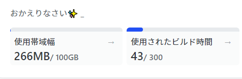

<div class="toc-title">目次</div>

```toc
```


## はじめに

基本無料だが以下の範囲に限るようです。<br>

1. 帯域幅が1か月に100GBまで
2. ビルドできる時間が1か月に300分まで

<div class="boxparts ref">
  <div class="title"></div>

  Netlify 価格のページ<br>
  
  https://www.netlify.com/pricing/?_ga=2.257123211.1889317529.1677054191-99578306.1677054191#teams
</div>

<div class="boxparts ref">
  <div class="title"></div>
  
  **帯域幅とは**<br>
  「どのくらいユーザーにページを表示できるか」というような数値<br>

  帯域幅やビルドの利用時間はNetlifyのTOPで見ることができます。<br>
  <br>
    ※和訳表示の画像です。<br>
    ※開発初期でビルドしまくってた時期の画像です。<br>
    ※状況に夜と思いますが、100GBは10万PVでも大丈夫な数値だそうです。
</div>

## 無料枠超えたらいくら？

早々超えないと思いますが、2023/02時点では以下のようになっているようです。<br>

1. 帯域幅 100GB あたり 55 ドル
2. ビルド時間 500分 あたり 7 ドル

55ドルは高いですね・・<br>
円安などの影響でしょうか。<br>
<br>
万が一超えそうな場合は、スタータープランからプロ版に月額$ 19に加入するのが良さそうです。<br>
プロ版は以下の感じ。<br>

1. 帯域幅 1TB/月
2. ビルド時間 25,000 分/月

## 請求を防ぐには？
ヘルプページに以下の記載がありました。<br>
<br>
「機能をまったく使用しないことを除いて、従量制の機能の使用に制限を設定する方法はありません」<br>
<br>
＝サイトを削除するしかないみたいです。<br>

<div class="boxparts ref">
  <div class="title"></div>

  Netlify ヘルプのページ

  https://docs.netlify.com/accounts-and-billing/billing-faq/
</div>

## クレジットカードを入力しないとどうなりますか?

利用段階で支払情報を登録してない人が大半だと思いますが、支払い通知が来るみたいです。<br>
そのあと、支払いが無い場合は請求通知が続くようです。<br>
<br>
早々超えないと思いますが、超えたときはプロに移行か、しっかり支払うのが良いですね。<br>

<div class="boxparts ref">
  <div class="title"></div>

  Netlify ヘルプのページ<br>

  <a href="https://docs.netlify.com/accounts-and-billing/billing-faq/#what-will-happen-if-i-don-t-enter-my-credit-card" target="_blank">クレジットカードを入力しないとどうなりますか?</a>
  
</div>


## その他

個人的にヘルプページを眺めてたら気になった点を簡単に書いておきます。<br>
英語読めないので間違胃もあるかもしてません。<br>
<br>

- 現在の使用量が下位レベルの制限を超えている場合、従量制機能の下位レベルにダウングレードすることはできません。(強制的にアップグレードされるということみたいです。)

<div class="boxparts ref">
  <div class="title"></div>

  Netlify ヘルプのページ<br>
  https://docs.netlify.com/accounts-and-billing/billing-faq/
</div>


<div class="balloon">
  <div class="icon"></div>
  <div class="talk">
早々超えないと思いますが、自動課金はNetlifyのデメリットの1つになりそうです。<br>
もし超えたら月2000円くらいのプロ版に入るのが良さそうです。<br>
<br>
こうなると毎年およそ一万円前後のレンタルサーバーを借りたほうがよくはなるのか・・<br>
  </div>
</div>
