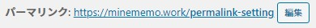

<div class="toc-title">目次</div>

```toc
```

はじめに
----

この設定方法は当ブログを構築する際に調べたものになります。  
人にとって必要なものが異なる場合もあると思いますが、あらかじめご了承をお願いいたします。

利用環境は以下の通りです。

- PC：Windows10
- レンタルサーバー：ロリポップ
- 利用テーマ：JIN(有料)

パーマリンクとは
--------

パーマリンクとは記事を作成する際に生成される記事のURLです。

確か初期設定は

<div class="boxparts ref">
  <div class="title"></div>
  
  https://ドメイン/年/月/ここは記事のタイトルです/
</div>

みたいになっていたと思います。

URL構造も深いですし、日本語が含まれるURLをブラウザからコピーすると、URLエンコードがかかり下のようにカオスな文字列になります笑

<div class="boxparts ref">
  <div class="title"></div>
    https://minememo.work/年/月/ここは記事のタイトルです/<br>
    ↓<br>
    https://minememo.work/%E5%B9%B4/%E6%9C%88/%E3%81%93%E3%81%93%E3%81%AF%E8%A8%98%E4%BA%8B%E3%81%AE%E3%82%BF%E3%82%A4%E3%83%88%E3%83%AB%E3%81%A7%E3%81%99/<br>
    <br>
    ※一緒のURLです。
</div>

**「シンプルなURL構造を維持する」というのがGoogleのSEO的にも</span>推奨**されているので、<span style="color: #ff0000;">**それにあわせてURL構造をパーマリンク設定でシンプルにしていくことが必要**</span>になります。


<div class="boxparts ref">
  <div class="title"></div>
  
  **Googleの記述を抜粋**

サイトの URL 構造はできる限りシンプルにします。  
論理的かつ人間が理解できる方法で可能な場合は ID ではなく意味のある単語を使用してURLを構成できるよう、コンテンツを分類します。

URL では区切り記号を使うと効果的です。  
http://www.example.com/green-dress.html という URL の方が、http://www.example.com/greendress.html という URL よりずっとわかりやすくなります。  
URL にはアンダースコア（\_）ではなくハイフン（-）を使用することをおすすめします。

Googleの抜粋元のページ  
https://support.google.com/webmasters/answer/76329?hl=ja

</div>


設定方法
----

### WordPressの設定

この設定は一回だけ行えばOKです。

1. WorPressの管理画面に移動
2. 設定&gt;&gt;パーマリンク設定
3. カスタム構造に/ %postname% を入力
4. 「変更を保存」をクリック

### 記事を作成する際の設定

この設定は記事を作成するごとに必要です。

記事作成画面の上部に以下があると思います。  
「編集」をクリックし適宜設定をしてください。



※URLの表示はサンプルです。記事によって異なります。  
※WordPressの新しいエディタの場合は画面の右側に「パーマリンク」のボタンがあったと思います。

以上で設定完了です。

<div class="balloon">
  <div class="icon"></div>
  <div class="talk">
  お疲れ様でした！
  </div>
</div>
