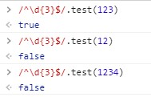
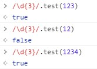

<div class="toc-title">目次</div>

```toc
```


はじめに
----

JavaScriptのtest()と正規表現を使い、数字の桁数を制限しようとしたのですが、あれ？限定されないという事象に遭遇しました。

また普通に調べて出てくる記事で間違いが多かったのでメモを兼ねて記事にしようと思います。

正しい数字の桁数制限
----------

数字三桁に制限したい場合は<span style="color: #ff0000;">**数字三桁(\\d{3})**</span>を<span style="font-weight: 600; letter-spacing: 0.8px; color: #ff0000;">行頭(^)と行末($)で囲みます</span>

```javascript:title=javascript
/^\d{3}$/.test(123)
```

↓Chromeのコンソールでの検証結果



間違ってるパターン
---------

行頭(^)と行末($)がない場合は～桁以上になるようです。

↓Chromeのコンソールでの検証結果



<div class="balloon">
  <div class="icon"></div>
  <div class="talk">
以前はあまりひっかかることなかったような気もするので、何か変わったのかな。<br><br>
あまりにも間違ってる記事が多かったので、不安もあるのですが、Chromeで試した結果なのでシェアしておきます。  
もし間違いあれば教えてください。
  </div>
</div>