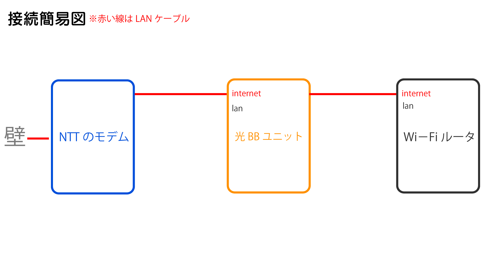

<div class="toc-title">目次</div>

```toc
```


はじめに
----

Y!mobile + SoftBank 光 でおうち割の割引を受けていたのですが、Y!mobileを解約。

**おうち割が外れること**でWi-Fiを使うためだけに、**毎月約1500円の支払い**が発生するのはかなり<span style="color: #ffcc00;">**クレイジ～**</span>だと感じたので(既知の事実)、**SoftBank 光のWi-Fiマルチパックを解約**しました。

※Wi-Fiマルチパック(467円税抜)+光BBユニット(990円税抜)

解約にあたり、Wi-Fiルータを購入し環境を構築していたのですが、**Wi-Fiマルチパックがないと光BBユニットで<span style="color: #ff0000;">Wi-Fiが使えなくなる</span>**という問題や<span style="color: #ff0000;"><span style="color: #000000;">、</span>**IPv6などでひっかかりうまくつながらなくなった**</span>ので、<span style="color: #0000ff;">**解決方法**</span>などをブログにしておこうと思います。

ちなみにAmazonで購入したWi-Fiルータはこちら  
<iframe allowfullscreen="" frameborder="0" height="550" loading="lazy" src="https://read.amazon.com.au/kp/card?preview=inline&linkCode=kpd&ref_=k4w_oembed_1Cd767amfiVATk&asin=B07JHBBW9H&tag=kpembed-20" style="max-width:100%" title="TP-Link Wi-Fi 無線LAN ルーター 11ac AC2600 1733 + 800 Mbps MU-MIMO IPv6 デュアルバンド ギガビット 【 Works with Alexa 認定】Archer A10 メーカー保証３年" type="text/html" width="500"></iframe>

繋がらなくなったときの事象
-------------

- YouTubeの利用とGoogle検索の結果までしかアクセスできない
- 検索結果の先のページや他のWEBサイトにアクセスできない
- Twitterで表示はできるが投稿・更新ができない

繋がらなくなった原因
----------

いろいろ調べてるうちにわかったのですが、今回購入したルータで初期設定を行った際に**IPv6で通信を行う設定**になっており、**大多数のサイトが****IPv4にしか対応していないため繋がらなくなった**ということが原因でした。

YouTube含むGoogleのサイトはIPv6に対応している数少ないサイトだったので繋がっていたということですね。

**ただ光BBユニットでWi-Fiを利用しているときはIPv6でも問題なく利用できていた+IPv6でのメリット**があるので、個人的には引き続きIPv6を利用したいと考えました。

<div class="boxparts ref">
  <div class="title"></div>
  
**IPv6とは**

IP（インターネットプロトコル）という通信に関する規約を定めたものでv6はその種類の一つ。

従来の形式が IPv4 で新しい形式が IPv6 になります。

インターネットはIPアドレスという被らない数値をコンピュータごとに発行し通信がされているのですが、その数値パターンがv4では足りなくなってきているのでv6が登場しました。

参考元  
<https://ja.wikipedia.org/wiki/IPv6>
</div>


IPv6のメリット
---------

あまり詳しくないので詳細は参考元を見ていただきたいのですが、ざっと以下の点を<span style="color: #0000ff;">**メリット**</span>と考えています。

1. IPv4は枯渇していくのがわかっており、IPv6が普及すると思うのでIPv6を継続利用したい
2. 従来の接続方式のPPPoEではなく、IPoEという接続方式なので速度があがる
3. 機器の初期設定でPPPoEの場合に必要だったID、パスワードが不要になる

※SoftBank 光なら ご利用開始のご案内 や MySoftBank で確認できる **S-IDとパスワード** がPPPoE設定に必要なID、パスワードになります。

※パスワードは確認ができないので、自身でしっかり記録しておく必要があります(<span style="color: #ff0000;">やっかい</span>)

<div class="boxparts ref">
  <div class="title"></div>
  
[IPv6のメリットとデメリットについて。通信速度が速くなる条件とは？](https://www.odorikoblog.net/entry/ipv6-speed/)
</div>


事象を解消した方法
---------

<span style="color: #ff0000;">**結論ですが、光BBユニットに購入したWi-Fiルータを接続してWi-Fiを使う**</span>ということでした。

IPv6を使いながら、数多くあるIPv4のサイトに対応するためには<span style="color: #ff0000;">**「IPv6 IPoE + IPv4」**</span>という通信の仕組み(v4とv6両方つなげるようにする)を利用しないと駄目だったんです。

SoftBank 光でIPv6 IPoE + IPv4を使うためには、<span style="color: #ff0000;">**光BBユニットが必須**</span>ということを思い出し以下のように接続をしなおしたらうまくいきました…



最後に
---

正直数年に一回確認するかしないかなので、こんな難しい仕組み覚えていられません🙄  
多くの人がはまってしまうポイントだと思うので、<span style="color: #ff0000;">**光BBユニットが必須はやめて**</span>ほしいですね。

「IPv6 IPoE + IPv4」の利用条件はインターネットの提供元で異なり、提供元の会社次第のようなので、ただ通信があれば利用できる状態であればこんなことにはならなかったんです。

※IPv6 IPoE + IPv4 は 「IPoE/IPv4 over IPv6」 ともいわれるみたいです。

<span style="color: #808080;">**IPv6とは？  
利用できない原因はルータ？プロバイダ？  
どこのなにを設定？  
接続方法は？**</span>

とか確認するのにすごく時間がかかりました。  
こんなことわからずに挫折する人はかなりいると思います（#^ω^）

<div class="balloon">
  <div class="icon"></div>
  <div class="talk">
  同じような事象で接続できない！という方の助けになれば幸いです。 お疲れさまでした！
  </div>
</div>


おまけ
---

SoftBankのおうち割が解除されるとどのくらい値段があがるのか。  
今回のパターンではありますがざっと記載しておきます。

参考になれば幸いです。

### Y!mobile + SoftBank 光 のおうち割の割引額

#### 今回の契約していたプラン

- Ymのスマホプラン：スマホプランM/R
- SB固定回線：SoftBank 光
- おうち割加入に必要な固定回線の指定オプション  
  ※光BBユニットレンタル + Wi-Fiマルチパック + BBフォン

#### 受けれた割引額

<span style="color: #ff0000;">**-200円/月**</span>です。  
※おうち割の-700円+固定回線の指定オプション500円 = <span style="color: #ff0000;">**200円割引**</span>

<div class="boxparts memo">
  <div class="title"></div>
  
**おうち割とは**   
Y!mobileの対象のプラン + 固定通信サービス\*1 + 固定通信サービスの契約者で指定オプション\*2のに加入することで適用される割引

\*1 SoftBank 光やSontBank Air

**\*2 指定オプションとは**

以下3つのオプションを合わせて、本来であれば1500円程度かかるものが500円で契約できるものです。

1. 光BBユニットレンタル(467円税抜/月)
2. Wi-Fiマルチパック(990円税抜/月)/Wi-Fi地デジパックのいずれか
3. ホワイト光電話/BBフォン/光電話（N）およびBBフォン(0円/月)のいずれか

※この情報は 20/05/01 時点です。  
詳細は公式を見てみてください。

[おうち割 光セット（A）/](https://www.ymobile.jp/plan/discount/hikarisetwari/)  
[光BBユニットレンタルの料金](https://www.softbank.jp/ybb/option/bbunit/price/)  
[Wi-Fiマルチパックの料金](https://www.softbank.jp/ybb/option/wifi-multi/price/)  
[地デジチューナープラス／Wi-Fi地デジパックの料金](https://www.softbank.jp/ybb/option/chidezi/price/)  
[BBフォンの料金](https://www.softbank.jp/ybb/option/bbphone/price/)
</div>


### おうち割が外れた時に発生する金額

固定回線の指定オプション500円が**おうち割解除**により<span style="color: #ff0000;">**1457円/月(税抜)**</span>で請求されます。

※ 光BBユニットレンタル(467円/月)+Wi-Fiマルチパック(990円/月)+BBフォン(0円/月) = 1457円/月(税抜)(今回の私の場合)

**-200円/月しか割引**を受けれてなかったのに、**外した瞬間に毎月1457円/月(税抜)**の請求がくるなんて恐ろしいですね。

なので、今回はWi-Fiマルチパック(990円/月)を外して、Wi-Fiルータを買って、IPv6のWi-Fiを整えたというわけです。

### ソフトバンクでの解約について

ソフトバンクの解約は大変です。

電話がつながらないので、解約したい日が決まってる場合は**日にち単位で余裕**を持ったほうが良いです。**月跨ぎでの料金には注意**しましょう。

個人的には<span style="color: #ff0000;">**チャットがおすすめ**</span>です。  
  
<span style="letter-spacing: 0.8px;">WEBに関しては導線が複雑すぎてほぼうまくいきません。  
WEBでオプションを停止しようとしたら、以下三つのログインが必要でした。</span>

1. <span style="letter-spacing: 0.8px;">生年月日+郵便番号+電話番号</span>
2. SID
3. Yahoo Japan ID

Yahoo Japan IDに関しては**書類に書いてない**+YmobileのYahoo Japan IDでもログイン不可だったので、もうお手上げでした。

※今はコロナ情勢の縮小で電話は切れるし、チャットは閉まってるので連絡手段がほぼなく解約がほんと難しすぎました。

<div class="balloon">
  <div class="icon"></div>
  <div class="talk">
IPv6のことといい、ややこしくて数日かかる原因はすべてソフトバンクの仕組みのせいでした。<br>
調べるだけでもかなりの疲労感なのに、連絡取れないことが多々あるので、皆様も気を付けてください。
  </div>
</div>